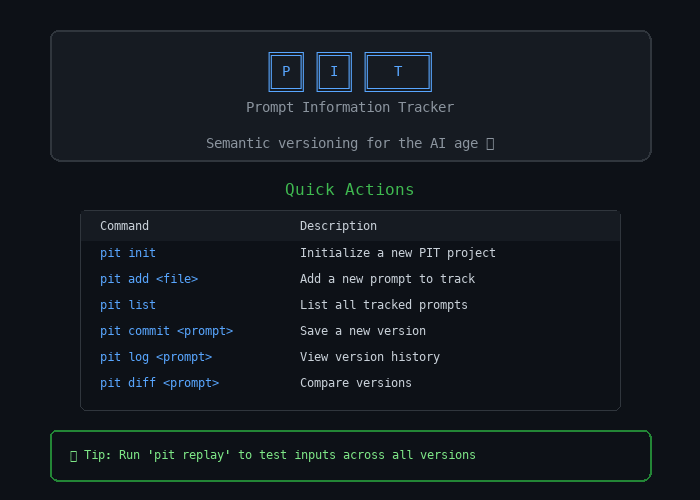
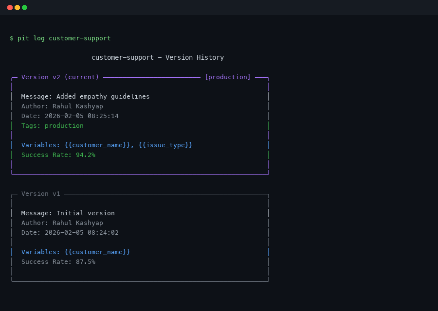
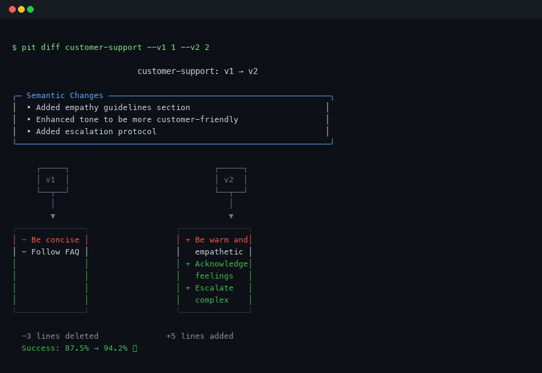
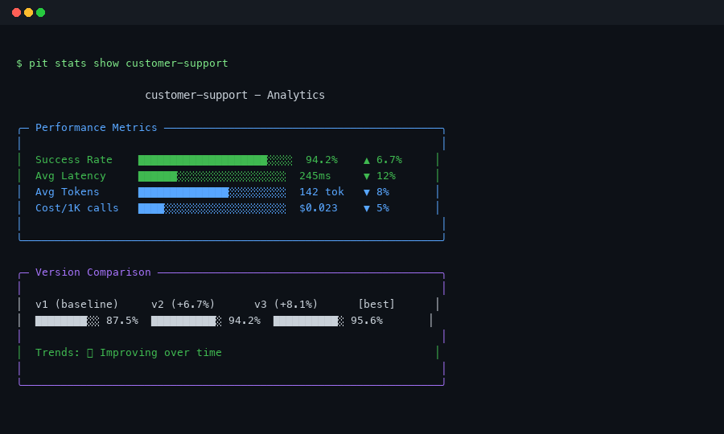

# 🕳️ PIT (Prompt Information Tracker)

```
    ╔═══════════════════════════════════════════════════════════╗
    ║                                                           ║
    ║     ██████╗ ██╗████████╗    ████████╗██████╗  █████╗ ██╗  ║
    ║     ██╔══██╗██║╚══██╔══╝    ╚══██╔══╝██╔══██╗██╔══██╗██║  ║
    ║     ██████╔╝██║   ██║          ██║   ██████╔╝███████║██║  ║
    ║     ██╔═══╝ ██║   ██║          ██║   ██╔══██╗██╔══██║██║  ║
    ║     ██║     ██║   ██║          ██║   ██║  ██║██║  ██║███████╗
    ║     ╚═╝     ╚═╝   ╚═╝          ╚═╝   ╚═╝  ╚═╝╚═╝  ╚═╝╚══════╝
    ║                                                           ║
    ║           Semantic Version Control for LLM Prompts        ║
    ║                                                           ║
    ╚═══════════════════════════════════════════════════════════╝
```

> **Git for Prompts** — Version control that actually understands your LLM prompts

[](https://www.python.org/downloads/)
[](https://opensource.org/licenses/MIT)
[]()
[](https://pypi.org/project/pit-cli/)

---

## 🚀 What is PIT?

PIT is a **semantic version control system** designed specifically for managing LLM prompts. Unlike traditional Git workflows, PIT understands the *meaning* of your prompts—tracking not just what changed, but *why* it matters for your AI's behavior.

**Stop treating prompts like plain text files. Start versioning them like the critical assets they are.**

---

## ✨ Features

### 📝 Core Version Control
| Feature | Description |
|---------|-------------|
| **Semantic Versioning** | Track prompt changes with meaningful version numbers |
| **Automatic Variable Detection** | Extracts Jinja2 template variables (`{{variable}}`) on commit |
| **Rich Diff Visualization** | Compare versions with syntax highlighting |
| **Tagging System** | Mark important versions (`production`, `stable`, `experimental`) |
| **Instant Checkout** | Switch between prompt versions instantly |
| **Query Language** | Search: `success_rate >= 0.9`, `content contains 'be concise'` |

### 🤝 Collaboration & Sharing
| Feature | Description |
|---------|-------------|
| **Shareable Patches** | Export/import prompt changes as `.promptpatch` files |
| **Prompt Bundles** | Package and share prompts with dependencies |
| **Time-Travel Replay** | Test same input across all versions |
| **Git-Style Hooks** | Validation and automation (pre-commit, post-checkout) |
| **External Dependencies** | Depend on prompts from GitHub, local paths, or URLs |

### 📊 Advanced Analytics
| Feature | Description |
|---------|-------------|
| **A/B Testing** | Statistically significant comparisons with scipy-powered t-tests |
| **Performance Tracking** | Monitor tokens, latency, success rates, costs per version |
| **Regression Testing** | Automated test suites to catch prompt degradations |
| **Analytics Dashboard** | Rich terminal charts and HTML reports |
| **Binary Search (Bisect)** | Find which version broke behavior |
| **Worktrees** | Multiple prompt contexts without switching |
| **Stash** | Save WIP with full context |

### 🔒 Security & Quality
| Feature | Description |
|---------|-------------|
| **Security Scanner** | OWASP LLM Top 10 compliance checking |
| **Prompt Injection Detection** | Catch malicious input patterns |
| **PII/API Key Detection** | Prevent data leakage |
| **Auto-Optimizer** | AI-powered prompt improvement suggestions |
| **Semantic Merge** | Categorize changes and detect conflicts |

---

## 📸 Screenshots

### 🎯 Interactive Menu


### 📝 Version Control


### 🔍 Rich Diff Visualization


### 📊 Analytics Dashboard


---

## 🚀 Quick Start

### Installation

```bash
pip install pit
```

Or with optional LLM provider support:

```bash
# With Anthropic Claude support
pip install pit[anthropic]

# With OpenAI support  
pip install pit[openai]

# With everything
pip install pit[all]
```

### Initialize a Project

```bash
# Create a new prompt repository
mkdir my-prompts
cd my-prompts
pit init
```

### Add Your First Prompt

```bash
# Add a prompt file
pit add system-prompt.md --name "customer-support" \
  --description "AI assistant for customer support"
```

### Version Control

```bash
# Commit a new version
pit commit customer-support --message "Added empathy guidelines"

# View version history
pit log customer-support

# Compare versions
pit diff customer-support --v1 1 --v2 2

# Checkout a specific version
pit checkout customer-support --version 1

# Tag a version
pit tag customer-support --version 2 --tag production
```

---

## 📚 Command Reference

### Core Commands
```bash
pit init                    # Initialize a new PIT project
pit add <file>              # Add a prompt to track
pit list                    # List all tracked prompts
pit commit <prompt>         # Save a new version
pit log <prompt>            # View version history
pit diff <prompt>           # Compare versions
pit checkout <prompt>       # Switch to a version
pit tag <prompt>            # Manage tags
```

### Advanced Features
```bash
# Patches
pit patch create <prompt> v1 v2 --output fix.patch
pit patch apply fix.patch --to <prompt>

# Hooks
pit hooks install pre-commit
pit hooks run pre-commit --prompt <prompt>

# Bundles
pit bundle create my-bundle --prompts "p1,p2" --with-history
pit bundle install my-bundle.bundle

# Replay
pit replay run <prompt> --input "Hello" --versions 1-5
pit replay compare <prompt> --input "Hello" --versions 1,3,5

# Dependencies
pit deps add shared github org/repo/prompts --version v1.0
pit deps install

# Worktrees
pit worktree add ./feature-wt <prompt>@v2

# Stash
pit stash save "WIP: improving tone"
pit stash pop 0

# Bisect
pit bisect start --prompt <prompt> --failing-input "bad query"
pit bisect good v1
pit bisect bad v5

# Testing
pit test create-suite --name "support-tests"
pit test add-case support-tests --name "greeting"
pit test run <prompt> --suite support-tests

# A/B Testing
pit ab-test <prompt> --variant-a 2 --variant-b 3 --sample-size 100

# Security
pit scan <prompt>
pit validate <prompt> --fail-on high

# Optimization
pit optimize analyze <prompt>
pit optimize improve <prompt> --strategy detailed

# Analytics
pit stats show <prompt>
pit stats report <prompt> --output report.html
```

---

## 📁 Project Structure

```
my-prompts/
├── .pit/                   # PIT database and config
│   ├── config.yaml         # Project configuration
│   └── pit.db              # SQLite database
├── prompts/                # Your prompt files
│   └── customer-support.md
└── .pit.yaml              # Optional: global config
```

---

## ⚙️ Configuration

Create `.pit.yaml` in your project root:

```yaml
# LLM Provider Configuration
llm:
  provider: anthropic      # anthropic, openai, ollama
  api_key: ${ANTHROPIC_API_KEY}
  model: claude-3-sonnet-20240229

# Default settings
defaults:
  auto_commit: false
  require_tests: true

# Security policies
security:
  max_severity: medium     # fail on medium+ severity issues

# Performance thresholds
performance:
  max_latency_ms: 2000
  min_success_rate: 0.95
```

---

## 📊 PIT vs Git

| Feature | Git | PIT |
|---------|-----|-----|
| Line-by-line diff | ✅ | ✅ |
| Semantic understanding | ❌ | ✅ |
| Variable tracking | ❌ | ✅ |
| Performance metrics | ❌ | ✅ |
| A/B testing | ❌ | ✅ |
| Security scanning | ❌ | ✅ |
| Prompt optimization | ❌ | ✅ |
| Shareable patches | ❌ | ✅ |
| Git-style hooks | ❌ | ✅ |
| Query language | ❌ | ✅ |
| Time-travel replay | ❌ | ✅ |
| Bundle packaging | ❌ | ✅ |
| External dependencies | ❌ | ✅ |
| LLM framework integration | ❌ | ✅ |

---

## 🧪 Testing

```bash
# Run all tests
pytest

# With coverage
pytest --cov=pit

# Run specific test file
pytest tests/test_core/test_security.py -v
```

---

## 🤝 Contributing

We welcome contributions! Please see our [Contributing Guide](CONTRIBUTING.md) for details.

---

## 📝 License

PIT is released under the MIT License. See [LICENSE](LICENSE) for details.

---

## 🙏 Acknowledgments

- Built with [Typer](https://typer.tiangolo.com/) for CLI magic
- Powered by [Rich](https://rich.readthedocs.io/) for beautiful terminal output
- Inspired by the need for better prompt management in production LLM systems

---

## 📬 Support

- 📧 Issues: [GitHub Issues](https://github.com/itisrmk/pit/issues)
- 💬 Discussions: [GitHub Discussions](https://github.com/itisrmk/pit/discussions)

---

<p align="center">
  <strong>Made with ❤️ for the LLM community</strong>
</p>

<p align="center">
  <sub>Where prompts go to evolve 🌱</sub>
</p>
